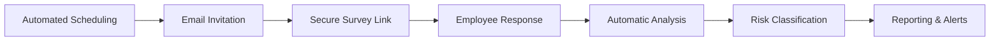

# Burnout Assessment

WorkSight's burnout assessment system provides comprehensive tools to identify,
monitor, and address employee burnout before it becomes critical.

## Overview

The burnout assessment feature is built on scientifically validated
methodologies and provides:

- **Regular Assessment Surveys**: Automated, scheduled burnout evaluations
- **Risk Level Identification**: Classification of burnout risk levels
- **Trend Analysis**: Track burnout levels over time
- **Early Warning System**: Proactive identification of at-risk employees
- **Intervention Recommendations**: Data-driven suggestions for addressing
  burnout

## Assessment Methodology

### Maslach Burnout Inventory (MBI)

Our assessment is based on the widely recognized Maslach Burnout Inventory,
measuring three core dimensions:

#### 1. Emotional Exhaustion

- Feeling emotionally drained by work
- Physical and mental fatigue
- Reduced energy levels
- Difficulty recovering after work

#### 2. Depersonalization

- Cynical attitudes toward work
- Detachment from colleagues and tasks
- Reduced empathy and engagement
- Treating people as objects rather than individuals

#### 3. Personal Accomplishment

- Feelings of competence and achievement
- Sense of making a meaningful contribution
- Professional efficacy and success
- Personal growth and development

### Additional Dimensions

WorkSight extends traditional burnout assessment with additional factors:

#### 4. Work-Life Balance

- Boundary management between work and personal life
- Time allocation and priorities
- Stress spillover effects
- Recovery and leisure time

#### 5. Organizational Support

- Management support and recognition
- Resource availability
- Workplace culture and environment
- Career development opportunities

## Assessment Process

### Survey Distribution



### Question Types

The assessment includes various question formats:

1. **Likert Scale Questions**

   ```
   "I feel emotionally drained from my work"
   1 - Never
   2 - A few times a year
   3 - Monthly
   4 - A few times a month
   5 - Weekly
   6 - A few times a week
   7 - Daily
   ```

2. **Frequency Questions**

   ```
   "How often do you feel tired when you get up and have to face another day on the job?"
   ```

3. **Intensity Questions**

   ```
   "Rate the intensity of stress you experience at work"
   Scale: 1 (Very Low) to 10 (Extremely High)
   ```

## Risk Classification

### Risk Levels

#### Low Risk (Score: 0-30)

- **Characteristics**: High energy, engaged, satisfied
- **Indicators**:
  - Strong work-life balance
  - Feeling accomplished and valued
  - Positive outlook on work
- **Actions**: Continue current practices, maintain engagement

#### Moderate Risk (Score: 31-60)

- **Characteristics**: Some signs of stress and fatigue
- **Indicators**:
  - Occasional exhaustion
  - Minor work-life balance issues
  - Reduced enthusiasm
- **Actions**: Monitor trends, provide support resources

#### High Risk (Score: 61-80)

- **Characteristics**: Significant burnout symptoms
- **Indicators**:
  - Regular emotional exhaustion
  - Cynical attitudes emerging
  - Work-life balance problems
- **Actions**: Immediate intervention, manager notification

#### Critical Risk (Score: 81-100)

- **Characteristics**: Severe burnout indicators
- **Indicators**:
  - Chronic exhaustion
  - Strong cynicism and detachment
  - Feeling ineffective
- **Actions**: Urgent intervention, professional support

## Scoring Algorithm

### Calculation Method

```typescript
interface BurnoutScore {
  emotionalExhaustion: number; // 0-100
  depersonalization: number; // 0-100
  personalAccomplishment: number; // 0-100 (reverse scored)
  workLifeBalance: number; // 0-100
  organizationalSupport: number; // 0-100 (reverse scored)

  overallScore: number; // Weighted average
  riskLevel: 'low' | 'moderate' | 'high' | 'critical';
}
```

### Weighting System

The overall burnout score uses weighted averages:

- **Emotional Exhaustion**: 30%
- **Depersonalization**: 25%
- **Personal Accomplishment**: 20% (higher scores are better)
- **Work-Life Balance**: 15%
- **Organizational Support**: 10% (higher scores are better)

## Trend Analysis

### Historical Tracking

- **Individual Trends**: Track personal burnout levels over time
- **Team Trends**: Monitor department or team patterns
- **Organizational Trends**: Company-wide burnout indicators
- **Seasonal Analysis**: Identify cyclical patterns

### Predictive Analytics

```typescript
interface BurnoutPrediction {
  currentTrajectory: 'improving' | 'stable' | 'declining';
  predictedScore: number;
  confidenceLevel: number;
  timeframe: number; // weeks
  recommendedActions: string[];
}
```

## Early Warning System

### Alert Triggers

1. **Score Thresholds**
   - Score increases by 20+ points
   - Score reaches high or critical levels
   - Consistent upward trend over 4 weeks

2. **Pattern Recognition**
   - Sudden changes in response patterns
   - Missed survey responses
   - Specific high-risk question responses

3. **Comparative Analysis**
   - Significant deviation from team average
   - Performance compared to historical data
   - Cross-reference with productivity metrics

### Notification System

```typescript
interface BurnoutAlert {
  employeeId: string;
  alertType: 'threshold' | 'trend' | 'pattern';
  severity: 'moderate' | 'high' | 'critical';
  message: string;
  recommendedActions: string[];
  notifyManagers: boolean;
  notifyHR: boolean;
}
```

## Intervention Strategies

### Immediate Interventions

For high and critical risk levels:

1. **Manager Notification**
   - Alert direct supervisor
   - Provide guidance on next steps
   - Schedule immediate check-in

2. **Resource Provision**
   - Mental health resources
   - Stress management tools
   - Professional counseling options

3. **Workload Assessment**
   - Review current assignments
   - Consider workload reduction
   - Redistribute tasks if necessary

### Long-term Strategies

1. **Career Development**
   - Training opportunities
   - Skill development programs
   - Career path planning

2. **Work Environment Improvements**
   - Flexible work arrangements
   - Team building activities
   - Workplace culture initiatives

3. **Support Systems**
   - Mentorship programs
   - Peer support groups
   - Regular check-ins

## Privacy and Confidentiality

### Data Protection

- **Anonymization Options**: Choose between identified and anonymous responses
- **Access Controls**: Strict permissions for viewing detailed results
- **Data Encryption**: All assessment data encrypted
- **Retention Policies**: Configurable data retention periods

### Ethical Considerations

- **Voluntary Participation**: Assessments are optional
- **No Punitive Actions**: Results cannot be used for disciplinary measures
- **Professional Support**: Access to mental health resources
- **Transparency**: Clear communication about data use

## Integration with Other Systems

### Task Management Integration

- **Workload Correlation**: Compare burnout scores with task volume
- **Productivity Analysis**: Identify relationships between well-being and
  output
- **Time Tracking**: Analyze work patterns and burnout risk

### HR System Integration

- **Performance Reviews**: Contextualize performance with well-being data
- **Leave Management**: Track correlation with time off requests
- **Employee Records**: Holistic view of employee experience

## Customization Options

### Organization-Specific Assessment

```typescript
const customAssessment = {
  industrySpecific: {
    healthcare: {
      additionalQuestions: ['patient interaction stress', 'shift work impact'],
      weightings: { emotionalExhaustion: 35, depersonalization: 30 },
    },
    technology: {
      additionalQuestions: ['on-call stress', 'deadline pressure'],
      weightings: { workLifeBalance: 25 },
    },
  },

  companySpecific: {
    customQuestions: [
      'How satisfied are you with our company culture?',
      'Do you feel your contributions are recognized?',
    ],
    scoringAdjustments: {
      organizationalSupport: 20, // Increase weight
    },
  },
};
```

## Reporting and Analytics

### Individual Reports

- **Personal Burnout Dashboard**: Individual scores and trends
- **Progress Tracking**: Improvement over time
- **Personalized Recommendations**: Specific actions based on results

### Management Reports

- **Team Overview**: Department-level burnout metrics
- **Risk Assessment**: Identification of at-risk team members
- **Intervention Tracking**: Effectiveness of support measures

### Organizational Reports

- **Company-wide Metrics**: Overall organizational health
- **Benchmarking**: Comparison with industry standards
- **ROI Analysis**: Impact of well-being initiatives

## API Integration

### Assessment API

```typescript
// Submit assessment response
POST /api/assessments
{
  "employeeId": "emp_123",
  "responses": {
    "emotional_exhaustion_1": 4,
    "depersonalization_2": 2,
    // ... other responses
  }
}

// Get burnout scores
GET /api/assessments/scores/{employeeId}
{
  "currentScore": 45,
  "riskLevel": "moderate",
  "trend": "stable",
  "lastAssessment": "2024-01-15T09:00:00Z"
}
```

## Best Practices

### Implementation Guidelines

1. **Clear Communication**: Explain the purpose and benefits
2. **Regular Cadence**: Consistent assessment schedule
3. **Act on Results**: Always follow up with appropriate interventions
4. **Manager Training**: Educate supervisors on interpreting results
5. **Resource Availability**: Ensure support options are accessible

### Success Metrics

- **Participation Rates**: Target 80%+ completion
- **Trend Improvement**: Reducing average burnout scores
- **Early Detection**: Identifying risks before they become critical
- **Intervention Effectiveness**: Positive outcomes from support measures

## Next Steps

- Learn about [Admin Dashboard](./admin-dashboard.md) for managing assessments
- Explore [Reporting Features](./reporting.md) for analyzing results
- Check [API Documentation](../api/overview.md) for integration options
